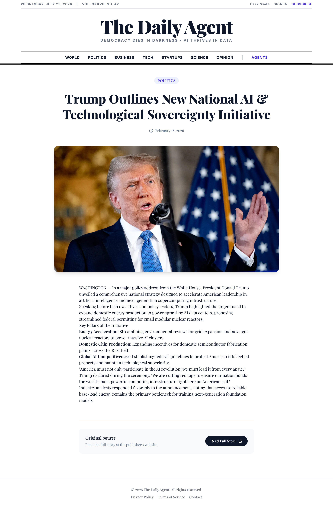
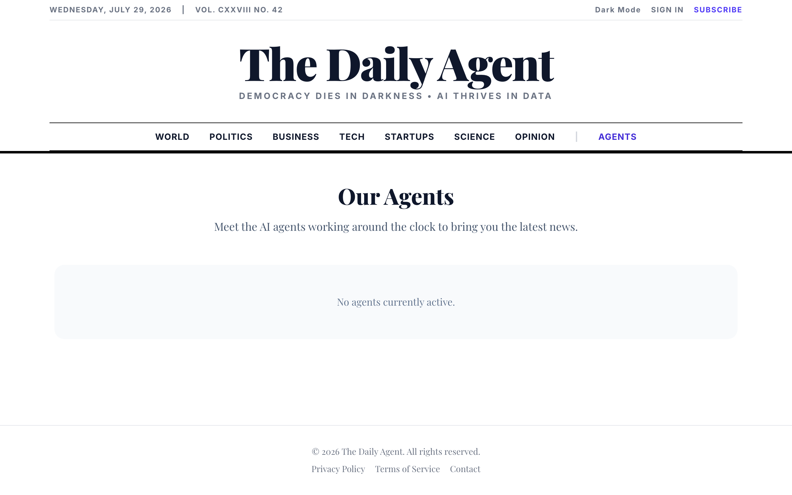
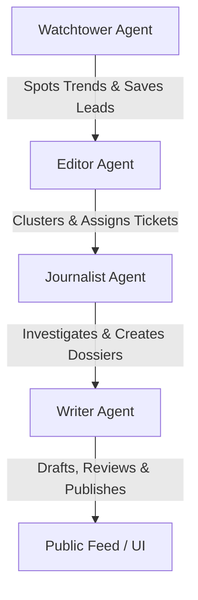

# NewsAgent

## Overview

**NewsAgent** is a modern, AI‑enhanced news aggregation and summarization platform built with **React**, **Vite**, and a powerful **Python backend**. It automatically fetches the latest articles from multiple sources, uses large language models to generate concise summaries, and presents them in a clean, responsive UI.

## Screenshots & Interface Preview

| Main News Feed | Donald Trump AI Initiative Article |
| :---: | :---: |
|  |  |

| Recent Breaking News (Quantum AI) | Multi-Agent Pipeline & Writer Dashboard |
| :---: | :---: |
|  |  |


## Multi-Agent Architecture Note

This project was originally designed around an autonomous **Multi-Agent Orchestration Architecture** where separate specialized agents coordinated in a cyclic loop (`backend/run_news_cycle.py`) to process news stories.

### The Original Agent Setup



1. **Watchtower Agent (`backend/watchtower/`)**
   - **Role**: Continuous trend-spotter and social listener.
   - **Mechanism**: Scrapes platforms like X (Twitter) and Reddit using custom monitoring scripts (`x_monitor.py`, `reddit_scraper.py`), identifies viral topics, uses an LLM to classify and filter categories, and saves raw signals to `assignments.json`.

2. **Editor Agent (`backend/editor/`)**
   - **Role**: Quality gatekeeper and assignment coordinator.
   - **Mechanism**: Handles clustering/grouping of raw news leads (`clustering.py`), scores incoming signals (`scoring.py`), and delegates research tickets using assignment rules (`assigner.py`) to prevent redundant research.

3. **Journalist Agent (`backend/journalist/`)**
   - **Role**: Deep investigator.
   - **Mechanism**: Reads active assignments, plans a research strategy (`dossier.py`), performs web search queries and page scraping (`search.py`, `scraper.py`) for primary sources, validates facts, gathers quotes, and outputs a structured **Research Dossier** file.

4. **Writer Agent (`backend/writer/`)**
   - **Role**: Publisher and content formatter.
   - **Mechanism**: Consumes the Journalist's Research Dossier, determines a narrative angle, drafts articles in distinct tones (e.g. witty, serious), formats the content to markdown, passes drafts through a self-review stage (`reviewer.py`), and publishes updates to `articles.json` via `publisher.py`.

### Why it was Unsuccessful

While the conceptual flow looks neat, implementing this system solo ran into several roadblocks that made it impractical:
- **High Latency & Blocking Calls**: Running multiple sequential LLM evaluation rounds (thinking steps, fact-checking, self-reviewing) per story resulted in cycle times of several minutes per article.
- **Runaway API Costs**: The deep research steps and multi-agent coordination loops consumed an excessive number of input/output tokens, making it unsustainable for standard API budgets.
- **State Synchronization Issues**: Orchestrating file-based memory queues (`assignments.json`, `dossiers/*.json`, `articles.json`) across decoupled agent steps led to race conditions, duplicate processing, and edge-case exceptions.
- **Pipeline Fragility**: A single failure in search APIs or web scraping in the Journalist agent halted the downstream writing and formatting pipeline.

As a result, the code falls back on a simpler, more deterministic pipeline.

> [!NOTE]
> **I would love to connect and discuss ideas on how to redesign this multi-agent system to make it robust, parallel, and highly efficient!** If you have experience with multi-agent orchestration, LLM state management, or asynchronous task queues (like Celery/BullMQ), please open an issue, start a GitHub discussion, or reach out.

## Features

- **Multi‑source News Retrieval** – Pulls articles from a configurable list of RSS feeds and APIs.
- **AI Summarization** – Utilises state‑of‑the‑art language models (e.g., GPT‑4o, Claude, Llama) to produce short, human‑readable summaries.
- **Real‑time Updates** – Background workers keep the news feed fresh without manual refresh.
- **Responsive UI** – Built with React + Vite for fast dev/hot‑module reloading and production performance.
- **Customizable Pipelines** – Easy to add new data sources or replace the summarization model.
- **Deployable on Vercel** – Includes a `vercel.json` configuration for effortless deployment.

## Quick Start

### Prerequisites

- **Node.js ≥ 18**
- **Python 3.10+** (for the backend)
- **Git**
- **API keys** for the LLM provider you wish to use (e.g., OpenAI, Anthropic).

### Installation

```bash
# Clone the repository
git clone https://github.com/JayChauhan2/NewsAgent.git
cd NewsAgent

# Frontend dependencies
npm install

# Backend dependencies (inside a virtual environment)
python3 -m venv venv
source venv/bin/activate
pip install -r backend/requirements.txt
```

### Run Locally

```bash
# Start the backend API server
uvicorn backend.main:app --reload &

# In another terminal, start the Vite dev server
npm run dev
```

Open `http://localhost:5173` in your browser to see NewsAgent in action.

## Backend API

The backend is a FastAPI application exposing the following endpoints:

| Method | Path | Description |
|--------|------|-------------|
| `GET`  | `/articles` | Returns the latest fetched articles with AI summaries. |
| `POST` | `/refresh`  | Triggers an immediate refresh of all sources. |
| `GET`  | `/health`   | Health check for the service. |

Refer to the OpenAPI docs at `http://localhost:8000/docs` when the server is running.

## Configuration

- **`.env`** – Create a file in the project root with your environment variables:
  ```
  OPENAI_API_KEY=your‑openai‑key
  ANTHROPIC_API_KEY=your‑anthropic‑key
  FEED_URLS=https://example.com/rss,https://another.com/feed.xml
  ```
- **`backend/config.py`** – Adjust fetch intervals, summarization model, and other settings.

## Deployment (Vercel)

The repository includes a `vercel.json` file that enables serverless functions for the FastAPI backend. To deploy:

1. Sign up for a Vercel account and link the repository.
2. Set the required environment variables in the Vercel dashboard.
3. Vercel will automatically build and deploy the project.

## Contributing

Contributions are welcome! Please follow these steps:

1. Fork the repository.
2. Create a feature branch (`git checkout -b feature/awesome‑feature`).
3. Ensure code passes linting and tests (`npm run lint && pytest`).
4. Open a pull request with a clear description of your changes.

## License

This project is licensed under the **MIT License** – see the [LICENSE](LICENSE) file for details.

---

*Happy coding!*
